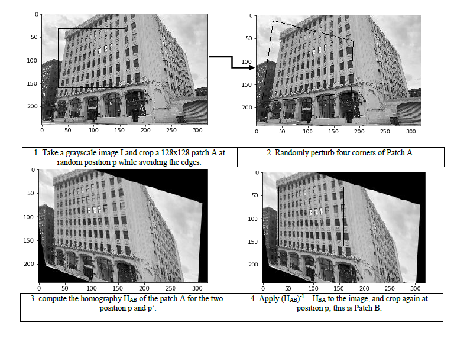

# Deep homography estimator (Pytorch)

This is an unofficial implementation of the paper "Deep Image Homography Estimation", by Daniel DeTone, Tomasz Malisiewicz, and Andrew Rabinovich: https://arxiv.org/pdf/1606.03798.pdf
      
      Traditional homography estimators are based on finding feature correspondences in images. The most common algorithms used
      for this task make the use of point feature correspondences as well as other features and they are based on corner 
      estimation and robust homography estimation. This work is based on the paper “Deep Image Homography Estimation”1 by Daniel 
      DeTone, Tomasz Malisiewicz and Andrew Rabnovich, in which the authors represent a deep convolutional neural network for 
      estimating the homography mapping between a pair of images without the need for feature detection processes and the 
      network is trained end-to-end using MS-COCO dataset images. 
      
MS-COCO 2017 dataset is a relatively big dataset (118,287 (18GB) of training samples). As described by the authors, we trained the network on 90000 iterations for 48 epochs. We used NVIDIA tesla p4 GPU, the training took approximately 7 hours. The training is optimized by stochastic gradient descent (SGD) with momentum of 0.9 and a learning rate of 0.005 and dropout enabled in the last convolutional layer and the first fully connected layer. We evaluated the model on MS-COCO 2017 validation set. The performance of our model is based on the L2 loss values omitted by the network.

Due to the specification of the task that requires a new way of organizing the data that will be fed into the network, we have implemented a costumized Dataset class in Pytorch so that the data loader can produces iterable samples of data knowing the sample X (2 batches A and B) and the corresponding label Y (H 4 points).

## Training setup: 

To train the network from scratch ob MS-COCO dataset we needed a powerful GPU. Fortunately, Google Cloud Platform GCP provides different types of GPU’s on the cloud in deep learning instances, so we have used a google compute engine with the following characteristics: 

----------------------------------------------------------------------------------------------------------------

•	High memory machine type with 8 vCPUs and 52 GB of memory.

•	200 GB disk.

•	NVIDIA tesla p4 GPU:

----------------------------------------------------------------------------------------------------------------
GPU Architecture              |	NVIDIA Pascal™
----------------------------------------------------------------------------------------------------------------
Single-Precision Performance  |	5.5 TeraFLOPS*Integer Operations (INT8)22 TOPS* (Tera-Operations per Second)
----------------------------------------------------------------------------------------------------------------
GPU Memory                    |	8 GB
----------------------------------------------------------------------------------------------------------------

Training deep convolutional networks from scratch requires a large amount of data. To meet this requirement, the authors have generated a large enough data from the MS-COCO dataset by applying random projective transformations to a large data.
The generation of images pairs as well as the corresponding homography is done within 4 steps:

Finally, Stack Patch A and Patch B channel-wise and feed into the network. Set HAB as the target vector.

